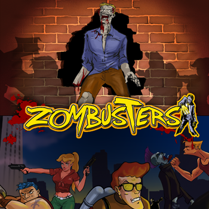

Zombusters
==========

*An action-packed 3rd person game for Windows, MacOS and Linux available for dowload on itch.io*

It will let you sticked on your seat until the end. Its 2D graphics and isometric view make it a different specie in its genre. You will have to face a horde of Zombies that try to get you down with the help of various weapons/power ups and different moving styles.

 

<b><a href="#features">Features</a></b>
|
<b><a href="#download">Download</a></b>
|
<b><a href="#a-bit-of-history">A bit of history</a></b>
|
<b><a href="#roadmap">Roadmap</a></b>
|
<b><a href="#who-made-this">Who Made This</a></b>
|
<b><a href="#bugs-and-feedback">Bugs and Feedback</a></b>
|
<b><a href="#licensing">Licensing</a></b>

 

 

### Features

* Variety of Weapons and Power-Ups
* Leaderboards
* Cool Indie Original Soundtrack (12 Tracks)
* 10 Different Maps
* 4 Playable Characters
* Input: Keyboard&Mouse and Gamepad (Xbox360)
* Original Pixel Art graphics
   

### Download

You can download it on **itch.io** here: [https://retrowax.itch.io/zombusters](https://retrowax.itch.io/zombusters)

**NOTE:** If you want to play the original version that was published to the Windows Store you can download the **commercial version** released (v1.0.0) for PC Windows **for free** [here](https://github.com/retrowax/Zombusters-Enhanced-Edition/raw/master/releases/ZombustersInstaller-v1.0.0.msi).

### Requirements

If you want to build this project, this is what you are going to need:

#### Windows
* Visual Studio Community 2019 (Visual C#)
* Monogame 3.6.1

#### MacOS
* Visual Studio for Mac
* Monogame 3.6.1
* NETCORE 2.2

A bit of history
----------------

This game started its development by the end of 2010 as a personal project that quickly escalated to a commercial project. It was published for the Xbox360 on November 5th of 2011 on XBLIG. There were a Windows Phone port released later that year and finally the PC for the Windows Store and Desura on July 2014. After that the game was something like abandoned until now, it's been almost 10 years of the first release on Xbox360 so we though that would be cool to revive this project and make it open-source.

The code released is not the original (that included all the code for other platforms), it's a modification that aim to be released for Windows (itch.io and Steam), MacOS and Linux.

Roadmap
-------

We would like to make an special version that enhances it. There is a lot of work to do:

* Automate builds and package generation. (CI) :heavy_check_mark:
* Add compatibility with MacOS and Linux.
* Update to latest version of Monogame.
* Improve controls.
* Improve scenes, remove blocking spots. :heavy_check_mark:
* Add more weapons and balance them.
* Add more Power-Ups.
* Improve Leaderboards.
* Achievements.
* SteamWorks features.

(:heavy_check_mark: all marked with this symbol are "done / completed")

Who made this
--------------

| 
|---
| [Ferran Pons](https://github.com/ferranpons)

Hi! I'm Ferran Pons; a Senior Android Developer that works for Adevinta Spain. With almost 15 years of experience as a programmer, my experience covers a lot of different kind of applications, from web app development to the desktop, mobile apps and videogames. I've participated in some blockbuster games such as Burnout Paradise, DeadSpace and the Skate franchise. Also I'm the owner of "Retrowax Games", an independent videogame studio, with which I've made this game that was published for the Xbox360 and Windows Phone and PC Windows.

Bugs and Feedback
-----------------

For bugs, questions and discussions please use the [Github Issues](https://github.com/retrowax/Zombusters/issues).

Roadmap
-------

If you want to follow the progress of this game check out the [Project tab](https://github.com/retrowax/Zombusters/projects/1) where you would find what we are working on and what are the new features implemented.

Licensing
---------

#### Assets

All art assets (``art``, ``music`` and
``sound``) are distributed under the 

 This work is licensed under a <a rel="license" href="http://creativecommons.org/licenses/by-nc/4.0/">Creative Commons Attribution-NonCommercial 4.0 International License</a>.

#### Code

Copyright 2011-2020 Ferran Pons

Licensed under the Apache License, Version 2.0 (the "License");
you may not use this file except in compliance with the License.
You may obtain a copy of the License at

    http://www.apache.org/licenses/LICENSE-2.0

Unless required by applicable law or agreed to in writing, software
distributed under the License is distributed on an "AS IS" BASIS,
WITHOUT WARRANTIES OR CONDITIONS OF ANY KIND, either express or implied.
See the License for the specific language governing permissions and
limitations under the License.
